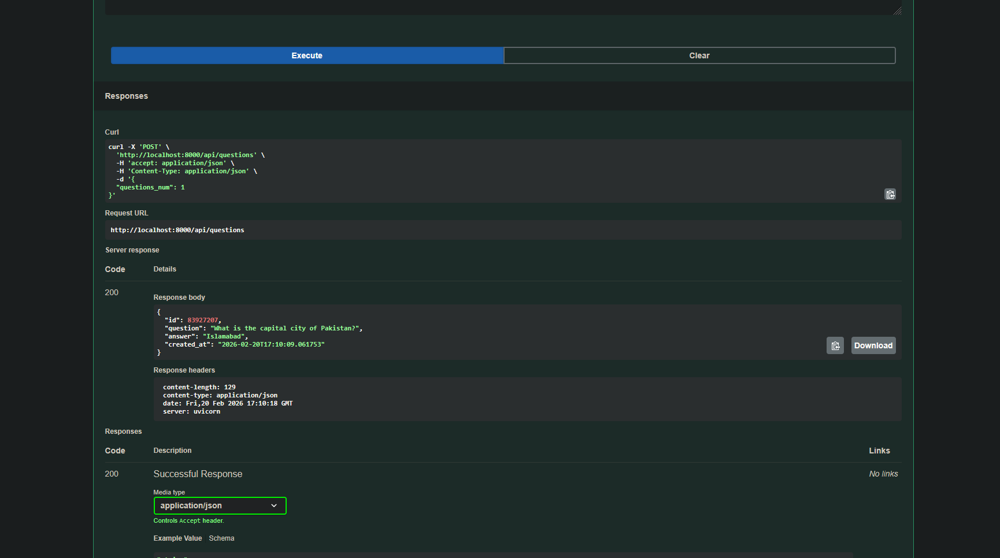
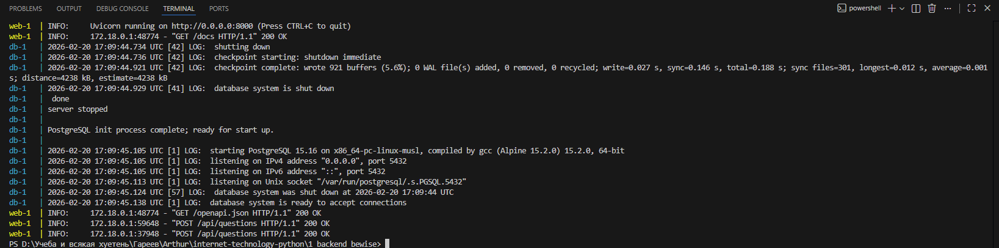
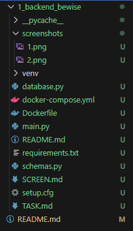

# Скриншоты работы сервиса

В данном разделе представлены подтверждения работоспособности бэкенд-сервиса и его интеграции с базой данных.

### 1. Тестирование API через Swagger UI
На данном скриншоте показан процесс отправки POST-запроса на эндпоинт `/api/questions` и получение успешного ответа (200 OK).

### 2. Логи Docker-контейнеров
Подтверждение того, что база данных PostgreSQL и приложение на FastAPI успешно запущены, связаны между собой и готовы к обработке запросов.

### 3. Структура проекта
Отображение файловой структуры проекта в редакторе, включая Dockerfile, docker-compose.yml и исходный код.

---
[Вернуться к основному описанию](README.md)