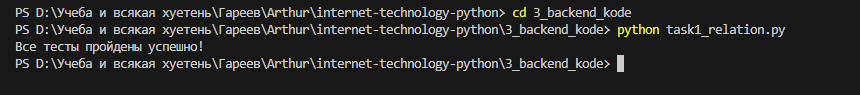
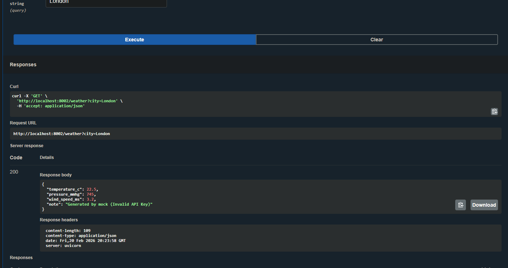
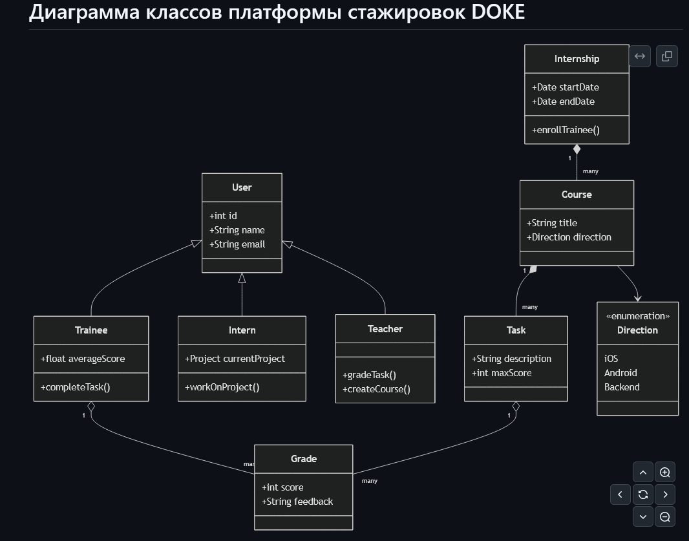

# Скриншоты работы (KODE Internship)

В данном разделе представлены доказательства успешного выполнения всех трех задач.

## Задача 1: Алгоритм поиска связей
Скриншот локального выполнения скрипта `task1_relation.py`. Все `assert` проверки пройдены успешно, что подтверждает корректность работы алгоритма обхода графа.

## Задача 2: API сервиса погоды (FastAPI + Docker)
Скриншот успешного GET-запроса к эндпоинту `/weather` через интерфейс Swagger UI. Сервис работает в Docker-контейнере и корректно возвращает данные (срабатывает заглушка + локальное кэширование на 30 минут).

## Задача 3: UML Диаграмма архитектуры
Отрендеренная Mermaid-диаграмма, описывающая структуру классов, наследование и связи для платформы проведения стажировок (DOKE).

---
[Вернуться к описанию задания](README.md)