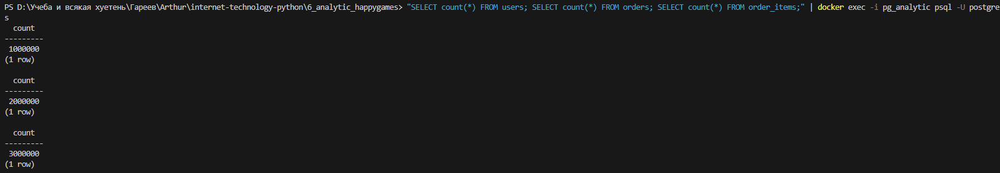
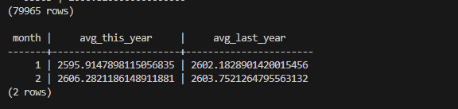
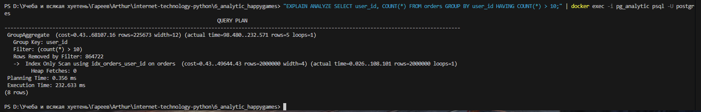

# Отчет по аналитическому заданию (HappyGamesStudio)

В данном проекте реализована аналитическая база данных на базе **PostgreSQL 16**. 

## 1. Проверка объема данных
Согласно техническому заданию, таблицы `users`, `orders` и `order_items` были наполнены данными объемом более 1 000 000 строк каждая. Это позволяет тестировать аналитические запросы в условиях, приближенных к реальной нагрузке.
* **Результат проверки количества строк**:

## 2. Результаты аналитики
Ниже представлен результат выполнения одного из ключевых запросов: расчет среднего чека по месяцам текущего года в сравнении с прошлым годом.

* **Сравнение среднего размера заказа (YoY)**:

## 3. Оптимизация запросов (Explain Analyze)
Для подтверждения производительности на миллионных выборках был проведен анализ плана выполнения запросов.
* **План выполнения (EXPLAIN ANALYZE)**:

* Использование индексов позволяет выполнять сложные агрегации на таблицах объемом более 1 млн строк в кратчайшие сроки.

## 4. Технические детали
* **База данных**: PostgreSQL 16.
* **Структура**: Созданы таблицы `users`, `orders` и `order_items` с необходимыми связями и типами данных.
* **Логика**: В файле `queries.sql` приведены решения для всех четырех аналитических задач, включая поиск активных пользователей и расчет средних показателей.